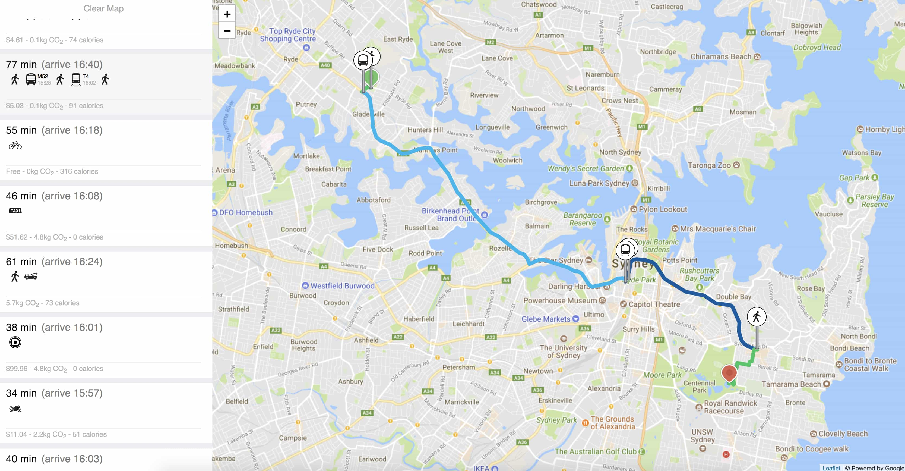
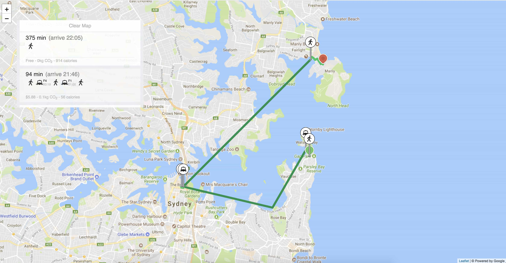
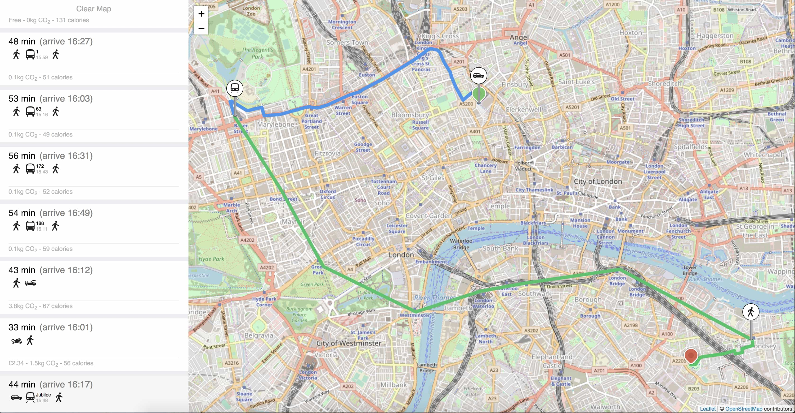

# TripGo Routing Leaflet Plugin

## API-Key
 Get your API key [here ](https://skedgo.com/en/tripgo-api/).
 
 API documentation [here ](https://developer.tripgo.com/).

The TripGo mobility platform let’s you create apps providing seamless and personalised door-to-door trips using any public, private or commercial mode of transport. 
It’s a single API connecting you to hundreds of transport providers around the globe.

TripGo leaflet's plugin motivation is to provide an easy way to include it's functionality in an external platform. TripGo provides free and enterprise services, more details [here ](https://skedgo.com/en/tripgo-api/pricing/).   

# Features

* Map interaction to select start and destination of the trip.
* Routing from start to destination using any public, private or commercial mode of transport. 
* Description for each trip, where you can see arrival time, trip duration, cost, pollution,
 modes of transports, etc.
* Customizable map tiles (Google and OSM).
* Customizable results UI (floating over the map or docked next to it)
* Open Source released under ISC License (more or less equivalent with the MIT license).
* Available transport modes:
    - Public transport
    - Walk
    - Bike
    - Bike share
    - Car
    - SwiftFleet
    - BlaBlaCar
    - Uber
    - My Driver
    - Taxi
   
# Getting started
 ## Includes
 
        [...]
        <link rel="stylesheet" href="https://unpkg.com/leaflet@1.2.0/dist/leaflet.css" />
        <link rel="stylesheet" href="css/TripgoRouting.css" />
        
        
        
        
        [...]
    
 ## Map definition 
    
        [...]
            

        [...]
    
 ## Plugin StartUp 
    
   ### default config

            [...]
              
            [...]
    
   ### Initialize Options
     
            [...]
                 
            [...]

   - options structure

        |option name  |default|comment|
        |----------- |-------  |------------|
        |mapId   |  "map" | Reference to the ***map box id*** defined in html code on map definition |
        |googleTile | true | If true the map will adopt Google Tile, if false the map will adopt OSM tile|
        |mapCenter | <pre> {"lat": -33.8650319, "lng": 151.2039176 } </pre> |Map point location. By default in Sydney, Australia.|
        |floatPanel | false |Change results panel style to float over the map|
        |tripgoApiKey| null|Key provided by ***TripGo API***. If tripgoApiKey field is absent, ***TripGo*** backend responds getting a global api key. | 
    

# Usage & examples

***Sydney***

- Default Configuration

- Float Configuration

***London***

 
   
#DEMO
https://skedgo.github.io/leaflet.tripgo.routing/    
   
# Npm

 <pre> npm install leaflet.tripgo.routing </pre>

